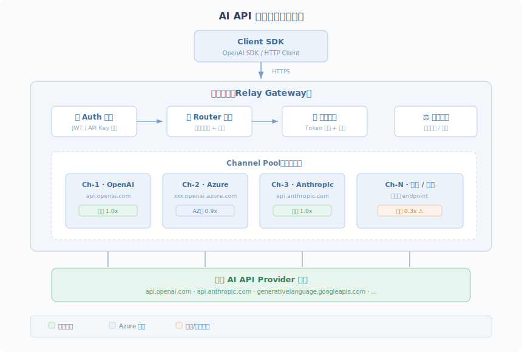
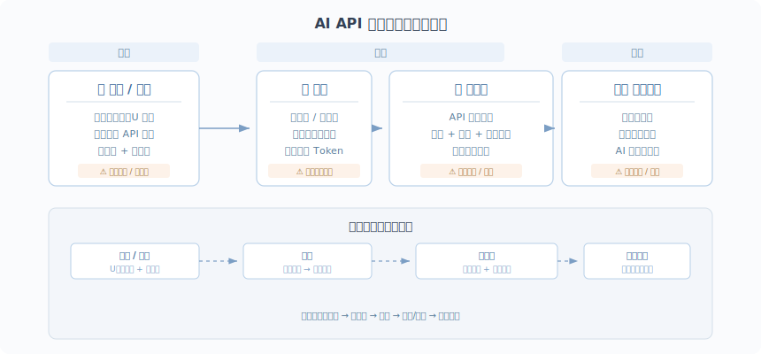
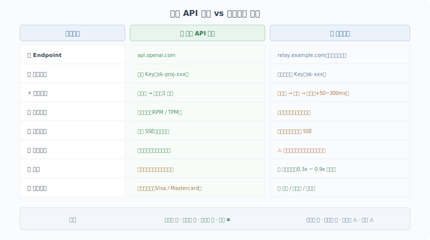
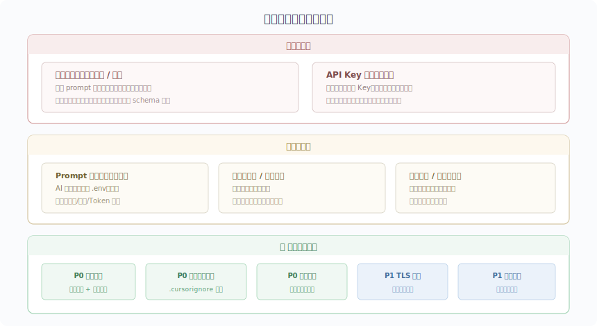

> 本文起源于 V2EX 社区帖子 [AI 中转站黑话大全整理](https://www.v2ex.com/t/1196011)（作者 v2exgo），在原帖内容基础上做了大量扩展和深入分析，面向专业研发人员，系统梳理 AI API 中转服务的技术架构、主流方案对比、安全风险评估与工程实践指南。

---

## 一、AI API 中转服务概述

### 1.1 什么是中转服务

AI API 中转服务（Relay / Proxy Service），本质上是一个 **API 网关（API Gateway）**，充当客户端应用与上游 AI 模型提供商（如 OpenAI、Anthropic、Google 等）之间的中间层。其核心工作流程：

```
Client App → [中转服务] → 上游 AI API Provider（OpenAI / Anthropic / Google ...）
                ↑
        请求转发、密钥注入、
        格式转换、负载均衡、
        计费计量、缓存优化
```

**中转服务存在的技术背景：**

- **网络封锁**：国内无法直接访问 `api.openai.com`、`api.anthropic.com` 等 endpoint
- **支付壁垒**：国际信用卡（Visa/Mastercard）绑定困难，部分平台不支持国内银行卡
- **合规限制**：部分 AI 服务商 ToS 明确限制特定地区的 API 访问

中转服务通过在海外部署代理节点，将请求透传到目标 API，再将响应返回给国内客户端，解决了上述痛点。

### 1.2 中转服务的技术架构

一个典型的中转站技术架构如下：



**核心模块说明：**

| 模块             | 职责                         | 技术实现                           |
| :--------------- | :--------------------------- | :--------------------------------- |
| **Auth 鉴权**    | 验证客户端 API Key，鉴权计费 | JWT / API Key 校验                 |
| **Router 路由**  | 根据模型名称路由到对应渠道   | 模型名映射 + 优先级/权重策略       |
| **Channel Pool** | 管理多个上游 API 账号/密钥   | 连接池 + 健康检查 + 自动故障转移   |
| **计费模块**     | Token 计量、余额扣减         | 基于 `usage` 字段的流式/非流式计费 |
| **负载均衡**     | 跨渠道分发请求               | 加权随机 / 轮询 / 优先级           |

### 1.3 产业链结构



---

## 二、主流中转服务方案

### 2.1 开源自建方案

以下是目前社区最主流的开源中转站项目：

| 项目                                                   | 技术栈            | 核心特性                                                          | GitHub Stars |
| :----------------------------------------------------- | :---------------- | :---------------------------------------------------------------- | :----------- |
| **[One-API](https://github.com/songquanpeng/one-api)** | Go + React        | 统一 OpenAI 格式接口，支持 30+ 模型提供商，三层倍率体系，多机部署 | 30k+         |
| **[New-API](https://github.com/Calcium-Ion/new-api)**  | 基于 One-API 二开 | 在 One-API 基础上增加 Midjourney/Suno 集成、缓存计费、企业级特性  | 19k+         |

**One-API / New-API 的倍率体系：**

```
最终扣费 = (input_tokens + output_tokens × 补全倍率) × 模型倍率 × 分组倍率
```

- **模型倍率（ModelRatio）**：不同模型的基础计费倍数，基准为 `$0.002/1K tokens = 1 倍`
- **补全倍率（CompletionRatio）**：输出 token 相对输入 token 的价格倍数
- **分组倍率（GroupRatio）**：针对不同用户组的差异化倍率

> **💡 衍生建议：** 对于高频、需要超长上下文的新一代 AI 编程工具（如 Claude Code），直接开通官方的订阅（如 $20/月的 Claude Pro）往往比在中转站被层层收取高额的输入、输出、缓存费用更便宜，且减少被封号或遇到模型被降智的风险。

### 2.2 商业中转服务

市面上也有大量商业化运营的中转站，通常提供：

- 预充值余额 + 按量计费
- 人民币支付（微信/支付宝）
- 多模型一站式接入
- 客服/技术支持

**选择商业中转站的核心考量：**

| 维度           | 评估要点                                           |
| :------------- | :------------------------------------------------- |
| **价格透明度** | 倍率是否公开？是否存在隐藏费用（汇率差、通道费）？ |
| **渠道来源**   | 官方 API Key vs 逆向工程 vs Azure 企业版？         |
| **SLA 保障**   | 是否承诺可用性（如 99.9%）？是否有故障补偿？       |
| **合规性**     | 是否提供发票？数据是否过境？是否有隐私协议？       |

### 2.3 企业级 LLM Gateway

对于有更高要求的企业场景，有专业的 LLM Gateway 方案：

| 方案                      | 定位              | 特色                                |
| :------------------------ | :---------------- | :---------------------------------- |
| **Cloudflare AI Gateway** | 网络原生 AI 网关  | 缓存、重试、分析、全球 CDN 加速     |
| **Kong AI Gateway**       | 企业 API 管理     | 插件生态、RBAC、审计日志            |
| **LiteLLM**               | 开源 Python Proxy | 100+ LLM API 统一为 OpenAI 格式     |
| **Bifrost (Maxim AI)**    | 高性能 AI 网关    | 11000+ 模型、语义缓存、自动故障转移 |

---

## 三、中转服务 vs 官方 API 对比

### 3.1 技术差异



### 3.2 响应格式差异

正规中转站会完整透传官方 API 的响应格式，但部分低质量中转站可能存在以下问题：

```json
// ❌ 常见问题：usage 字段缺失或不准确
{
  "choices": [...],
  "usage": null  // 部分中转站不返回 usage，导致客户端无法统计 token
}

// ❌ 常见问题：流式响应断裂
// SSE stream 中 chunk 丢失或延迟
data: {"choices":[{"delta":{"content":"Hello"}}]}
// ... 长时间无响应 ...
data: [DONE]

// ❌ 常见问题：模型名映射错误
// 请求 claude-3.5-sonnet，实际路由到 claude-3-haiku
```

---

## 四、如何识别是否在使用中转服务

作为开发者，你可能需要确认你（或你的团队成员）使用的 API 是否为官方直连。以下是几种检测方法：

### 4.1 检查 Base URL

最直接的方法——看 SDK 配置中的 `base_url`：

```python
# 官方直连
client = OpenAI(
    api_key="sk-xxx",
    base_url="https://api.openai.com/v1"  # ✅ 官方
)

# 中转服务
client = OpenAI(
    api_key="sk-xxx",
    base_url="https://some-relay.example.com/v1"  # ⚠️ 第三方
)
```

**注意检查环境变量**：

```bash
# 检查是否被环境变量覆盖
echo $OPENAI_API_BASE
echo $OPENAI_BASE_URL

# 常见的 IDE 插件（如 Cursor、Continue）配置文件
cat ~/.cursor/config.json
cat ~/.continue/config.json
```

### 4.2 HTTP 响应头分析

通过 curl 直接检查响应头：

```bash
curl -sI https://your-api-endpoint/v1/models \
  -H "Authorization: Bearer sk-xxx" | head -20
```

**官方 API 典型响应头：**

```http
server: cloudflare
cf-ray: xxx-LAX
openai-organization: org-xxx
openai-processing-ms: 150
x-ratelimit-limit-requests: 500
x-ratelimit-remaining-requests: 499
```

**中转服务可能出现的响应头特征：**

```http
server: nginx                    # 非 cloudflare
via: 1.1 relay-proxy             # Via 头暴露代理
x-forwarded-for: xxx             # 转发头
x-real-ip: xxx                   # 真实 IP 头
# 缺少 openai-organization 头
# 缺少 x-ratelimit-* 头
# 可能出现自定义头如 x-relay-channel 等
```

### 4.3 DNS / IP 分析

```bash
# 解析目标域名的 IP
dig +short your-api-endpoint

# 查看 IP 归属
whois $(dig +short your-api-endpoint) | grep -i org

# 官方 OpenAI API 通常解析到 Cloudflare 的 IP 段
# 中转站通常解析到 VPS 提供商（如 AWS、GCP、阿里云等）
```

### 4.4 API Key 格式鉴别

| API Key 格式        | 说明                         |
| :------------------ | :--------------------------- |
| `sk-proj-xxx...`    | OpenAI 官方项目密钥          |
| `sk-svcacct-xxx...` | OpenAI 服务账号密钥          |
| `sk-ant-xxx...`     | Anthropic Claude 官方密钥    |
| `sk-` + 短字符串    | 很可能是中转站自行签发的密钥 |

---

## 五、如何评估中转服务的稳定性与可靠性

### 5.1 核心评估指标

| 指标                          | 测试方法                              | 合格基准                       |
| :---------------------------- | :------------------------------------ | :----------------------------- |
| **可用性（Uptime）**          | 持续拨测 `/v1/models` endpoint        | ≥ 99.9%（月宕机 ≤ 43 分钟）    |
| **响应延迟（Latency）**       | 轻量请求（max_tokens=1）多次采样      | P95 ≤ 2s，额外代理延迟 ≤ 300ms |
| **流式首 Token 延迟（TTFT）** | 流式请求首个 chunk 到达时间           | ≤ 3s                           |
| **错误率（Error Rate）**      | 统计 4xx/5xx 响应比例                 | ≤ 0.5%                         |
| **模型一致性**                | 请求特定模型，验证返回的 `model` 字段 | 100% 匹配请求模型              |
| **Token 计费准确性**          | 对比中转站扣费与 `tiktoken` 预估      | 偏差 ≤ 5%                      |

### 5.2 模型真实性验证

部分不良中转站存在**模型降级**行为——请求 `claude-3.5-sonnet` 但实际路由到更便宜的模型。以下是几种检测思路：

```python
# 方法 1：检查响应中的 model 字段
response = client.chat.completions.create(
    model="claude-3-5-sonnet-20241022",
    messages=[{"role": "user", "content": "What model are you?"}]
)
print(f"请求模型: claude-3-5-sonnet-20241022")
print(f"响应模型: {response.model}")  # 应完全匹配
print(f"回答内容: {response.choices[0].message.content}")

# 方法 2：利用模型特有能力进行验证
# 例如测试视觉能力、长上下文窗口、特定知识截止日期等

# 方法 3：对比输出质量基准
# 使用标准化 benchmark prompt 对比官方 API 与中转的输出质量
```

### 5.3 渠道类型甄别与“掺假”行为

中转站的渠道来源直接影响稳定性和合规性。常见渠道类型：

| 渠道类型                 | 说明                           | 稳定性     | 价格            | 风险               |
| :----------------------- | :----------------------------- | :--------- | :-------------- | :----------------- |
| **官转（Official）**     | 使用正规付费的官方 API Key     | ⭐⭐⭐⭐⭐ | 高（≥1x 倍率）  | 低                 |
| **AZ 转（Azure）**       | 通过 Azure OpenAI Service 转发 | ⭐⭐⭐⭐   | 中高            | 中低               |
| **逆向（Reverse）**      | 逆向工程免费/付费版 Web 接口   | ⭐⭐       | 低（0.1x-0.5x） | 高，随时可能失效   |
| **号池（Account Pool）** | 批量注册试用账号的 API 额度    | ⭐⭐⭐     | 低              | 中高，账号可能被封 |

**⚠️ 警惕“官逆混用/掺假”：** 不良中转站会在官方渠道耗尽或不可用时，静默切换至低质的逆向渠道（即“官方挂了换逆向”或“白天并发用官转，晚上用逆向”）。这就导致即使接口可用，模型的智商、长上下文响应能力和 Tool Calling 能力也可能出现严重衰退。

### 5.4 隐形计费考量：缓存率（Cache Rate）的魔力

在比较多家中转站的价格时，绝不能只看表面的“大模型倍率”或单价。当前如 Claude Code 等重度依赖长上下文缓存的应用，价格构成公式应当是：
**总费用 = (Input + Output + Cache Write + Cache Read) × 倍率**

**为何缓存率极其重要：**

- 新一代工具极其依赖 Context Caching。
- 劣质中转站的**缓存率（Cache Rate）**可能只有 30%，甚至根本无法透传真实的缓存；而优质一线的官转服务缓存率能稳定在 80%~85% 以上。
- **缓存率差 10%，实际支出的真金白银可能翻倍。** 原本以为很便宜的低倍率渠道，因为没有有效利用缓存，实际花费远超高单价的高缓存率渠道。

### 5.5 持续监控建议

```yaml
# 建议部署持续拨测脚本，关键监控维度：
监控项:
  - endpoint: /v1/chat/completions
    interval: 5m
    timeout: 30s
    alerts:
      - condition: error_rate > 1%
        action: notify
      - condition: p95_latency > 5000ms
        action: warn
      - condition: model_mismatch
        action: critical
```

---

## 六、中转服务的安全隐患

> **⚠️ 这是使用中转服务时最需要关注的问题。** 即使中转站价格诱人、稳定性良好，安全风险也不容忽视。

### 6.1 核心威胁模型



### 6.2 无法回避的“HTTPS 中间人攻击”本质

**所有通过中转站的请求内容对中转站运营者绝对明文可见。**
不论中转站宣传采用了多少安全防护，从技术原理上说，中转服务本质就是一个 **HTTPS 中间人（MITM）**。为了做路由分发与计费计量，网关层必然要先解密请求。这意味着：

- 你发送给 AI 的**代码片段**、**数据库 schema**、**内部文档**、**聊天隐私**都在裸奔。
- 你在 prompt 中无意包含的**环境变量**、**配置信息**可能被轻易提取。
- 现代 AI 编码助手（如 Cursor、Windsurf、Claude Code）会自动将**海量项目代码上下文**发送到 API。

### 6.3 防护措施的局限性与终极建议

网络上经常有人推荐通过配置忽略文件来防护，但**这种防护往往给人一种虚假的安全感**。

#### 客户端侧配置（效果有限，仅能减小暴露面）

```bash
# 配置 .cursorignore / .claudeignore
echo ".env" >> .cursorignore
echo "*.pem" >> .cursorignore
echo "credentials/" >> .cursorignore
```

> **⚠️ 为什么说它有限：** 这些手段**仅能阻止 AI 工具主动去读**隐藏文件。但它阻止不了你在对话窗手动粘贴包含了密钥的内容，也阻止不了你代码文件中硬编码的密钥被发送。只要数据上了 prompt 请求体，中转站就完全可见。

#### 终极建议：敏感项目不走中转

这是唯一彻底的解决方案：**面对涉及核心商业机密、私钥/证书环境或高价值私有代码库的项目，唯一的安全方案是不走任何第三方中转，只走官方直连（或使用云厂商企业级私有化部署的 API 如 Azure OpenAI、AWS Bedrock）。**

#### 架构侧防护

```
推荐架构：在自有服务器上部署 API Gateway，自行管理上游密钥

Client → [自建 Gateway] → 官方 API
           ↑
     密钥加密存储
     请求日志审计
     敏感信息过滤
```

| 防护措施         | 说明                                     | 优先级 |
| :--------------- | :--------------------------------------- | :----- |
| **密钥隔离**     | 不同环境（dev/staging/prod）使用独立密钥 | P0     |
| **请求审计**     | 记录所有 API 请求的元数据（不含内容）    | P0     |
| **敏感信息过滤** | 在客户端侧过滤掉 prompt 中的密钥/密码    | P0     |
| **TLS 校验**     | 确保客户端严格校验中转站的 TLS 证书      | P1     |
| **最小权限**     | API Key 仅授予必要的模型访问权限         | P1     |
| **预算告警**     | 设置余额/用量告警，防止异常消耗          | P1     |
| **定期轮换**     | API Key 定期更换                         | P2     |

### 6.4 合规性考量

- **数据出境**：请求数据发送到海外中转节点，可能涉及《数据安全法》《个人信息保护法》中的数据出境条款
- **服务资质**：大部分中转站无 ICP 备案、无增值电信业务经营许可
- **税务合规**：预充值模式通常无法提供正规发票
- **知识产权**：Anthropic 等厂商在其报告中明确指出，商业代理服务可能被用于非法模型蒸馏

---

## 七、行业黑话速查表

| 术语         | 含义                                            |
| :----------- | :---------------------------------------------- |
| **刀**       | 虚拟美刀，通常 1 元人民币 = 1 刀（非真实汇率）  |
| **倍率**     | 模型价格系数，官转 ≈ 1x，逆向通常 0.1x-0.5x     |
| **官转**     | 使用官方正规 API Key 的中转渠道                 |
| **AZ 转**    | 通过 Azure OpenAI Service 中转                  |
| **逆向**     | 逆向工程 Web 版/App 版的非公开 API              |
| **号池**     | 批量注册的试用/免费 API 账号池                  |
| **官逆混用** | 宣称是官转，实则掺假混入低成本的逆向渠道来获利  |
| **缓存创建** | Cache Write，发送给大模型处理并创建缓存的 Token |
| **缓存命中** | Cache Read，已命中缓存的输入内容，价格极低      |
| **跑量**     | 在中转站消耗的 token 总量                       |
| **渠道**     | 中转站配置的上游 API Key/Provider               |
| **分组**     | 中转站内的用户等级/权限组                       |
| **补全倍率** | 输出 token 相对输入 token 的价格比              |

---

## 八、总结与建议

### 核心原则

中转服务本质是用安全性换取便利性和低价。在使用时，务必明确风险边界：**真正的商业机密绝不过中转，能走官方/云平台企业版的必须走正规渠道。**

### 面向个人使用

- **日常开发/学习**：中转服务是务实的降本选择，建议多参考近期排名的评测数据。
- **高频重度用户**：如果重度依赖 Claude Code 这种耗费 Context 的工具，直接购买官方 Max20/Pro 订阅套餐可能比在中转站被反复收取缓存费更经济，且能完全杜绝封号风控。
- **安全底线**：配好 ignore 文件是必要的基础，但更重要的是养成**不在对话中随意发送包含认证信息文本**的习惯。

### 面向企业使用

需要考虑的因素更多，包括：

- **自建方案**：使用 One-API / New-API 自建中转站，自行管理上游 API Key
- **合规要求**：涉及用户数据的场景
- **监控体系**：需要全链路监控，覆盖可用性、延迟、模型一致性、计费准确性
